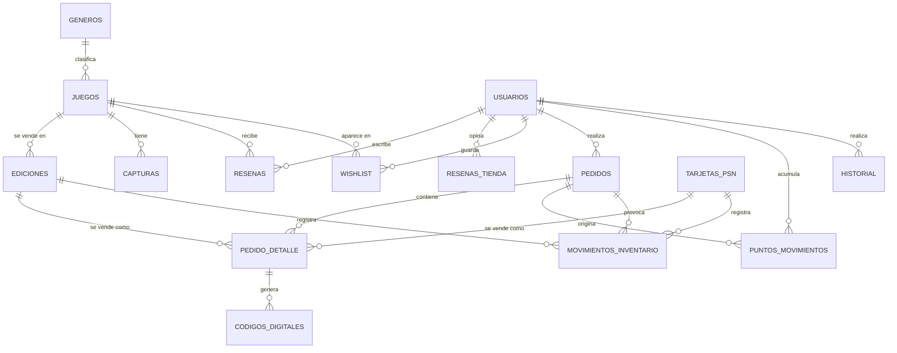

# Base de datos — Mala Fama Games

Motor: **MySQL / MariaDB** · juego de caracteres `utf8mb4` · 15 tablas relacionadas.

Archivos: [`database/schema.sql`](../database/schema.sql) crea la base desde cero y [`database/seed.sql`](../database/seed.sql) carga los datos de prueba.

## Diagrama entidad-relación

## Relaciones y cardinalidad

| Relación | Cardinalidad | Descripción |
|---|---|---|
| generos → juegos | 1 : N | Un registro de `generos` clasifica muchos de `juegos` |
| juegos → ediciones | 1 : N | Un registro de `juegos` se vende en muchos de `ediciones` |
| juegos → capturas | 1 : N | Un registro de `juegos` tiene muchos de `capturas` |
| juegos → resenas | 1 : N | Un registro de `juegos` recibe muchos de `resenas` |
| usuarios → resenas | 1 : N | Un registro de `usuarios` escribe muchos de `resenas` |
| usuarios → resenas_tienda | 1 : N | Un registro de `usuarios` opina muchos de `resenas_tienda` |
| usuarios → wishlist | 1 : N | Un registro de `usuarios` guarda muchos de `wishlist` |
| juegos → wishlist | 1 : N | Un registro de `juegos` aparece en muchos de `wishlist` |
| usuarios → pedidos | 1 : N | Un registro de `usuarios` realiza muchos de `pedidos` |
| pedidos → pedido_detalle | 1 : N | Un registro de `pedidos` contiene muchos de `pedido_detalle` |
| ediciones → pedido_detalle | 1 : N | Un registro de `ediciones` se vende como muchos de `pedido_detalle` |
| tarjetas_psn → pedido_detalle | 1 : N | Un registro de `tarjetas_psn` se vende como muchos de `pedido_detalle` |
| pedido_detalle → codigos_digitales | 1 : N | Un registro de `pedido_detalle` genera muchos de `codigos_digitales` |
| usuarios → puntos_movimientos | 1 : N | Un registro de `usuarios` acumula muchos de `puntos_movimientos` |
| pedidos → puntos_movimientos | 1 : N | Un registro de `pedidos` origina muchos de `puntos_movimientos` |
| ediciones → movimientos_inventario | 1 : N | Un registro de `ediciones` registra muchos de `movimientos_inventario` |
| tarjetas_psn → movimientos_inventario | 1 : N | Un registro de `tarjetas_psn` registra muchos de `movimientos_inventario` |
| pedidos → movimientos_inventario | 1 : N | Un registro de `pedidos` provoca muchos de `movimientos_inventario` |
| usuarios → historial | 1 : N | Un registro de `usuarios` realiza muchos de `historial` |

`wishlist` resuelve la relación **muchos a muchos** entre `usuarios` y `juegos`; `pedido_detalle` resuelve la relación muchos a muchos entre `pedidos` y los productos (ediciones o tarjetas).

## Normalización (3FN)

- **1FN:** todos los campos son atómicos; los formatos de venta no se guardan como lista dentro de `juegos`, sino como filas en `ediciones`.
- **2FN:** las tablas con llave compuesta (`wishlist`) no tienen atributos que dependan solo de una parte de la llave; el precio y la existencia dependen de la edición, no del juego.
- **3FN:** no hay dependencias transitivas: el nombre del género vive en `generos` y no se repite en `juegos`; los datos del cliente viven en `usuarios` y los pedidos solo guardan su `usuario_id`.
- **Desnormalizaciones intencionales:** `pedido_detalle.precio_unitario` y los totales de `pedidos` guardan el valor *al momento de la venta* (el precio del juego puede cambiar después); `pedidos.direccion_envio` guarda la dirección usada en esa compra; `juegos.calificacion` y `total_resenas` se recalculan con cada reseña para no promediar en cada consulta del catálogo.

## Integridad y restricciones

- Llaves primarias autoincrementales en todas las tablas; `wishlist` usa llave compuesta `(usuario_id, juego_id)`.
- Llaves foráneas con `ON DELETE CASCADE` solo donde el hijo no tiene sentido sin el padre (ediciones, capturas, detalle, códigos) y `SET NULL` en auditoría.
- `UNIQUE`: `juegos.slug`, `usuarios.email`, `generos.nombre`, `pedidos.folio`, `codigos_digitales.codigo`, `(juego_id, version, formato)` en ediciones, `(juego_id, usuario_id)` en reseñas y `usuario_id` en opiniones.
- `CHECK`: precio > 0, oferta menor al precio, existencia ≥ 0, puntos ≥ 0, calificaciones entre 1 y 5, cantidad > 0 y cada detalle apunta a una edición **o** a una tarjeta (nunca a ambas).
- Índices adicionales: `pedidos(creado)`, `pedidos(estado)`, `juegos(activo)`, `juegos(fecha_lanzamiento)`, `usuarios(rol)`, `historial(creado)`, `historial(entidad, entidad_id)`, `movimientos_inventario(creado)` para reportes y filtros.
- Baja lógica (`activo`) en `generos`, `juegos`, `usuarios`, `tarjetas_psn` y `codigos_digitales`.

## Datos de prueba (`seed.sql`)

- 8 géneros, 21 juegos con 40 ediciones y 4 tarjetas PSN.
- 10 usuarios: 1 administrador, 1 empleado y 8 clientes (contraseñas en el README).
- 89 reseñas y 5 opiniones de la tienda.
- 78 ventas de julio a septiembre de 2026 con 133 artículos, códigos, puntos, 138 movimientos de inventario y 82 registros de historial, para que el dashboard y los reportes tengan información real de la base.

## Diccionario de datos

### `capturas`

Imágenes adicionales de cada juego.

| Columna | Tipo | Nulo | Llave | Valor por defecto |
|---|---|---|---|---|
| `id` | int(11) | No | PK |  |
| `juego_id` | int(11) | No | FK → juegos.id |  |
| `ruta` | varchar(150) | No |  |  |
| `orden` | int(11) | No |  | 0 |

### `codigos_digitales`

Códigos entregados por cada pieza digital vendida. Se anulan si el pedido se cancela.

| Columna | Tipo | Nulo | Llave | Valor por defecto |
|---|---|---|---|---|
| `id` | int(11) | No | PK |  |
| `pedido_detalle_id` | int(11) | No | FK → pedido_detalle.id |  |
| `codigo` | varchar(40) | No | UQ |  |
| `activo` | tinyint(1) | No |  | 1 |
| `creado` | datetime | No |  | current_timestamp() |

### `ediciones`

Cada versión (Estándar, Deluxe, Ultimate...) y formato (físico o digital) en que se vende un juego, con su precio, precio de oferta, existencia y contenido extra.

| Columna | Tipo | Nulo | Llave | Valor por defecto |
|---|---|---|---|---|
| `id` | int(11) | No | PK |  |
| `juego_id` | int(11) | No | FK → juegos.id |  |
| `version` | varchar(40) | No |  | Estándar |
| `formato` | enum('fisico','digital') | No |  |  |
| `precio` | decimal(10,2) | No |  |  |
| `precio_oferta` | decimal(10,2) | Sí |  | NULL |
| `stock` | int(11) | No |  | 0 |
| `incluye` | varchar(255) | Sí |  |  |

### `generos`

Catálogo de géneros (Acción, RPG, Terror...). Baja lógica con `activo`.

| Columna | Tipo | Nulo | Llave | Valor por defecto |
|---|---|---|---|---|
| `id` | int(11) | No | PK |  |
| `nombre` | varchar(40) | No | UQ |  |
| `activo` | tinyint(1) | No |  | 1 |

### `historial`

Auditoría de operaciones importantes: quién, cuándo, qué registro y su estado anterior y nuevo (JSON).

| Columna | Tipo | Nulo | Llave | Valor por defecto |
|---|---|---|---|---|
| `id` | int(11) | No | PK |  |
| `usuario_id` | int(11) | Sí | FK → usuarios.id | NULL |
| `accion` | varchar(40) | No |  |  |
| `entidad` | varchar(40) | No | IDX |  |
| `entidad_id` | int(11) | Sí |  | NULL |
| `antes` | text | Sí |  | NULL |
| `despues` | text | Sí |  | NULL |
| `ip` | varchar(45) | Sí |  | NULL |
| `creado` | datetime | No | IDX | current_timestamp() |

### `juegos`

Datos del juego: sinopsis, fecha, idiomas, clasificación y calificación promedio (recalculada con las reseñas).

| Columna | Tipo | Nulo | Llave | Valor por defecto |
|---|---|---|---|---|
| `id` | int(11) | No | PK |  |
| `slug` | varchar(80) | No | UQ |  |
| `titulo` | varchar(120) | No |  |  |
| `genero_id` | int(11) | No | FK → generos.id |  |
| `sinopsis` | text | No |  |  |
| `fecha_lanzamiento` | date | No | IDX |  |
| `desarrollador` | varchar(80) | No |  |  |
| `clasificacion` | varchar(10) | No |  |  |
| `voces` | varchar(120) | No |  |  |
| `subtitulos` | varchar(120) | No |  |  |
| `requiere_internet` | tinyint(1) | No |  | 0 |
| `nota_internet` | varchar(120) | Sí |  | NULL |
| `trailer_youtube` | varchar(20) | Sí |  | NULL |
| `portada` | varchar(150) | Sí |  | NULL |
| `calificacion` | decimal(2,1) | No |  | 0.0 |
| `total_resenas` | int(11) | No |  | 0 |
| `activo` | tinyint(1) | No | IDX | 1 |
| `creado` | datetime | No |  | current_timestamp() |

### `movimientos_inventario`

Kardex: cada venta (-), cancelación (+) y ajuste manual con la existencia resultante.

| Columna | Tipo | Nulo | Llave | Valor por defecto |
|---|---|---|---|---|
| `id` | int(11) | No | PK |  |
| `edicion_id` | int(11) | Sí | FK → ediciones.id | NULL |
| `tarjeta_id` | int(11) | Sí | FK → tarjetas_psn.id | NULL |
| `pedido_id` | int(11) | Sí | FK → pedidos.id | NULL |
| `usuario_id` | int(11) | Sí | FK → usuarios.id | NULL |
| `tipo` | enum('venta','cancelacion','ajuste') | No |  |  |
| `cantidad` | int(11) | No |  |  |
| `stock_resultante` | int(11) | No |  |  |
| `nota` | varchar(160) | Sí |  | NULL |
| `creado` | datetime | No | IDX | current_timestamp() |

### `pedidos`

Encabezado de la venta: folio, totales, IVA, puntos, método de pago, estado del envío y datos de cancelación.

| Columna | Tipo | Nulo | Llave | Valor por defecto |
|---|---|---|---|---|
| `id` | int(11) | No | PK |  |
| `folio` | varchar(20) | Sí | UQ | NULL |
| `usuario_id` | int(11) | No | FK → usuarios.id |  |
| `subtotal` | decimal(10,2) | No |  |  |
| `descuento_puntos` | decimal(10,2) | No |  | 0.00 |
| `total` | decimal(10,2) | No |  |  |
| `iva` | decimal(10,2) | No |  | 0.00 |
| `puntos_usados` | int(11) | No |  | 0 |
| `puntos_ganados` | int(11) | No |  | 0 |
| `metodo_pago` | enum('tarjeta','paypal','mercadopago','oxxo') | No |  |  |
| `estado` | enum('pagado','preparando','enviado','entregado','cancelado') | No | IDX | 'pagado' |
| `direccion_envio` | varchar(255) | Sí |  | NULL |
| `numero_guia` | varchar(40) | Sí |  | NULL |
| `motivo_cancelacion` | varchar(255) | Sí |  | NULL |
| `cancelado_por` | int(11) | Sí | FK → usuarios.id | NULL |
| `fecha_cancelacion` | datetime | Sí |  | NULL |
| `creado` | datetime | No | IDX | current_timestamp() |

### `pedido_detalle`

Artículos de cada venta (una edición de juego o una tarjeta PSN) con el precio al momento de la compra.

| Columna | Tipo | Nulo | Llave | Valor por defecto |
|---|---|---|---|---|
| `id` | int(11) | No | PK |  |
| `pedido_id` | int(11) | No | FK → pedidos.id |  |
| `edicion_id` | int(11) | Sí | FK → ediciones.id | NULL |
| `tarjeta_id` | int(11) | Sí | FK → tarjetas_psn.id | NULL |
| `cantidad` | int(11) | No |  | 1 |
| `precio_unitario` | decimal(10,2) | No |  |  |

### `puntos_movimientos`

Programa de lealtad: puntos ganados (+) y usados o revertidos (-).

| Columna | Tipo | Nulo | Llave | Valor por defecto |
|---|---|---|---|---|
| `id` | int(11) | No | PK |  |
| `usuario_id` | int(11) | No | FK → usuarios.id |  |
| `pedido_id` | int(11) | Sí | FK → pedidos.id | NULL |
| `puntos` | int(11) | No |  |  |
| `concepto` | varchar(120) | No |  |  |
| `creado` | datetime | No |  | current_timestamp() |

### `resenas`

Calificación (1-5) y comentario de un cliente sobre un juego. Una por cliente y juego.

| Columna | Tipo | Nulo | Llave | Valor por defecto |
|---|---|---|---|---|
| `id` | int(11) | No | PK |  |
| `juego_id` | int(11) | No | FK → juegos.id |  |
| `usuario_id` | int(11) | No | FK → usuarios.id |  |
| `calificacion` | tinyint(4) | No |  |  |
| `comentario` | text | Sí |  | NULL |
| `creado` | datetime | No |  | current_timestamp() |

### `resenas_tienda`

Opinión de un cliente sobre la tienda. Una por cliente.

| Columna | Tipo | Nulo | Llave | Valor por defecto |
|---|---|---|---|---|
| `id` | int(11) | No | PK |  |
| `usuario_id` | int(11) | No | UQ FK → usuarios.id |  |
| `calificacion` | tinyint(4) | No |  |  |
| `comentario` | text | Sí |  | NULL |
| `creado` | datetime | No |  | current_timestamp() |

### `tarjetas_psn`

Tarjetas de saldo de PlayStation Store que se venden como código digital.

| Columna | Tipo | Nulo | Llave | Valor por defecto |
|---|---|---|---|---|
| `id` | int(11) | No | PK |  |
| `monto` | decimal(10,2) | No |  |  |
| `precio` | decimal(10,2) | No |  |  |
| `stock` | int(11) | No |  | 0 |
| `activo` | tinyint(1) | No |  | 1 |

### `usuarios`

Clientes y personal. El rol define los permisos (RBAC). Contraseña con bcrypt. Baja lógica con `activo`.

| Columna | Tipo | Nulo | Llave | Valor por defecto |
|---|---|---|---|---|
| `id` | int(11) | No | PK |  |
| `nombre` | varchar(100) | No |  |  |
| `email` | varchar(120) | No | UQ |  |
| `password_hash` | varchar(255) | No |  |  |
| `rol` | enum('admin','empleado','cliente') | No | IDX | 'cliente' |
| `telefono` | varchar(20) | Sí |  | NULL |
| `direccion` | varchar(255) | Sí |  | NULL |
| `puntos` | int(11) | No |  | 0 |
| `activo` | tinyint(1) | No |  | 1 |
| `creado` | datetime | No |  | current_timestamp() |

### `wishlist`

Lista de deseos: relación muchos a muchos entre usuarios y juegos.

| Columna | Tipo | Nulo | Llave | Valor por defecto |
|---|---|---|---|---|
| `usuario_id` | int(11) | No | PK FK → usuarios.id |  |
| `juego_id` | int(11) | No | PK FK → juegos.id |  |
| `creado` | datetime | No |  | current_timestamp() |
